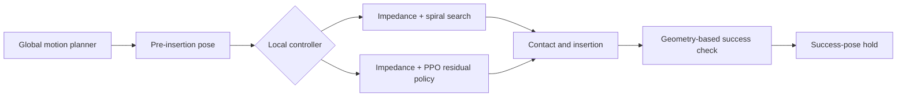

# Robust Peg-in-Hole Insertion with Impedance Control and Reinforcement Learning

A contact-stage manipulation system built with Isaac Sim, Isaac Lab, and RL-Games. The project combines a task-space impedance controller, a deterministic spiral-search baseline, and a residual PPO policy for peg insertion under pose-estimation error and contact-friction variation.

The system assumes a global motion planner moves the robot to a pre-insertion pose. It then handles the local contact-rich phase: alignment, contact search, insertion, success detection, and pose holding.

## System architecture



Both methods use the same Franka robot, 8 mm peg-and-hole geometry, 120 Hz physics loop, 15 Hz policy loop, and bounded task-space impedance controller. This keeps the comparison focused on the local recovery strategy.

## Core capabilities

- Four-phase deterministic controller: approach, downward preload with Archimedean spiral search, insertion, and pose hold.
- Residual reinforcement learning: PPO predicts bounded 6D pose corrections around the nominal insertion target while impedance control remains responsible for low-level motion.
- Episode-level domain randomization for hole pose, grasp pose, observation noise, initial tool orientation, and peg/hole friction.
- Independent switches for pose and friction randomization, enabling controlled ablation studies.
- Geometry-based terminal evaluation that distinguishes briefly entering the success region from completing and holding the insertion.
- Parallel simulation, TensorBoard logging, checkpointing, baseline evaluation, and reproducible smoke tests.

## Randomization and control limits

| Parameter | Range |
|---|---:|
| Hole position | ±5 mm XY, ±1 mm Z |
| Hole yaw | 0–10° |
| Initial tool position | ±4 mm XY, ±1 mm Z |
| Initial tool orientation | ±3° roll/pitch, ±5° yaw |
| Peg pose inside grasp | ±1 mm XY, ±0.5 mm Z |
| Hole observation noise | 2.0 mm XY, 1.0 mm Z standard deviation |
| Peg/hole friction | 0.30–1.20 |
| PPO position residual | ±6 mm XY, ±3 mm Z |
| PPO orientation residual | ±5° roll/pitch, ±10° yaw |

Instantaneous impedance error is clipped to 4 mm in XY and 3 mm in Z. With a Z stiffness of 400 N/m, the spring component of the commanded Z wrench is limited to approximately 1.2 N.

## Verified results

All fixed-search rows use 128 trials with seed 42.

| Evaluation distribution | Success rate | Mean successful time | Mean peak commanded force |
|---|---:|---:|---:|
| Easy calibration | 96.1% (123/128) | 2.87 s | 1.33 N |
| Challenge v1 | 50.0% (64/128) | 4.00 s | 2.33 N |
| Challenge v2, selected | 64.8% (83/128) | 3.92 s | 2.18 N |

Curriculum PPO training reached 100% on the nominal stage, 96.9% on medium randomization, 98.4% peak on intermediate randomization, and an 82.0% transient-success training scalar on the full pose-and-friction distribution. Independent final-geometry evaluation showed that the original scalar counted policies that entered the success region and later withdrew. The environment now latches the first successful pose and applies a 1.5 mm downward hold margin; a nominal deterministic check completed at 24.1 mm final insertion depth.

The 82.0% value is retained as a training diagnostic and is not reported as terminal deployment success. See [VERIFICATION.md](VERIFICATION.md) for the complete experiment record and [experiment_matrix.md](experiment_matrix.md) for the held-out evaluation protocol.

## Environment

- NVIDIA L4, 23 GB VRAM
- Isaac Sim 5.0
- Isaac Lab 2.2.1
- RL-Games PPO
- Python 3.11

Exact compatibility information is recorded in [compatibility.json](compatibility.json).

## Run

Set up Isaac Lab 2.2.1 and copy this repository to the compute instance:

```bash
export ISAACLAB_PATH=/workspace/IsaacLab
python -m pip install -r requirements-rl-games.txt
```

Validate environment registration, observation finiteness, and friction writes:

```bash
python scripts/smoke_test.py \
  --task baseline --num_envs 4 --steps 12 --headless \
  --output /workspace/results/smoke_baseline.json

python scripts/smoke_test.py \
  --task rl --num_envs 4 --steps 12 --headless \
  --output /workspace/results/smoke_rl.json
```

Evaluate the fixed-search controller:

```bash
python scripts/run_spiral_baseline.py \
  --trials 128 --num_envs 64 --seed 42 --headless \
  --output /workspace/results/spiral_seed42
```

Train the residual PPO policy:

```bash
python scripts/train_rl.py \
  --task Isaac-LocalInsertion-RL-Direct-v0 \
  --num_envs 128 --seed 42 --headless
```

Run a checkpoint:

```bash
python scripts/play_rl.py \
  --task Isaac-LocalInsertion-RL-Direct-v0 \
  --num_envs 128 --checkpoint /absolute/path/to/LocalInsertion.pth \
  --headless
```

The train and play entry points delegate to Isaac Lab's upstream RL-Games runners after registering the custom environments.

## Ablations

Disable one randomization source through Hydra overrides:

```bash
# Pose variation only
python scripts/train_rl.py \
  --task Isaac-LocalInsertion-RL-Direct-v0 --num_envs 128 --seed 42 --headless \
  env.randomization.friction_enabled=false

# Friction variation only
python scripts/train_rl.py \
  --task Isaac-LocalInsertion-RL-Direct-v0 --num_envs 128 --seed 42 --headless \
  env.randomization.pose_enabled=false

# Nominal condition
python scripts/train_rl.py \
  --task Isaac-LocalInsertion-RL-Direct-v0 --num_envs 128 --seed 42 --headless \
  env.randomization.pose_enabled=false env.randomization.friction_enabled=false
```

## Repository layout

```text
local_insertion/
  env_cfg.py                 environment, controller, and randomization configuration
  envs.py                    fixed-search and residual-RL environments
  policy_math.py             controller-independent trajectory utilities
  agents/                    RL-Games PPO configuration
scripts/
  run_spiral_baseline.py     batched baseline evaluation
  smoke_test.py              dynamic environment checks
  train_rl.py                PPO training entry point
  play_rl.py                 checkpoint evaluation entry point
tests/
  test_policy_math.py        local controller-math tests
```

## Evaluation protocol

The main comparison uses identical held-out initial states for the fixed-search controller and the full randomized PPO policy. Report success rate with a Wilson 95% interval, successful-episode completion time, maximum insertion depth, and peak commanded wrench. PPO experiments additionally report sample efficiency, training stability across seeds, and pose/friction randomization ablations.

Commanded wrench is a controller output rather than a force/torque sensor measurement.
