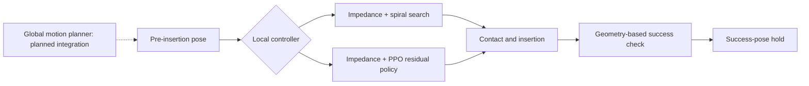

# Robust Peg-in-Hole Insertion with Impedance Control and Reinforcement Learning

A contact-stage manipulation system built with Isaac Sim, Isaac Lab, and RL-Games. The project combines a task-space impedance controller, a deterministic spiral-search baseline, and a residual PPO policy for peg insertion under pose-estimation error and contact-friction variation.

The implemented system starts at a pre-insertion pose and handles the local contact-rich phase: alignment, contact search, insertion, success detection, and pose holding. ROS 2 / MoveIt 2 integration and retreat/retry recovery are the next system milestones.

The unified evaluation pipeline has passed GPU integration: all three methods completed the same eight cases, with matching recorded initial states and a one-second terminal hold criterion. Zero residual succeeded in 2/8 cases, spiral search in 4/8, and the recovered PPO checkpoint in 3/8. This small integration sample does not establish a PPO advantage or a 95% success rate. See the [raw evidence and analysis](benchmarks/gpu_integration_20261002/README.md) and [evaluation runbook](docs/EVALUATION.md).

## System architecture


```mermaid
flowchart LR
    A[Global motion planner: planned integration] -.-> B[Pre-insertion pose]
    B --> C{Local controller}
    C --> D[Impedance + spiral search]
    C --> E[Impedance + PPO residual policy]
    D --> F[Contact and insertion]
    E --> F
    F --> G[Geometry-based success check]
    G --> H[Success-pose hold]
```

The new benchmark runs spiral search, zero residual, and PPO in the same environment: Franka robot, 8 mm peg-and-hole geometry, 120 Hz physics, 15 Hz policy control, the same pre-insertion initialization, a 10 s horizon, and a common bounded impedance controller with pose hold. The historical standalone spiral controller is retained for reproducing earlier calibration only.

## Core capabilities

- Four-phase deterministic controller: approach, downward preload with Archimedean spiral search, insertion, and pose hold.
- Residual reinforcement learning: PPO predicts bounded 6D pose corrections around the nominal insertion target while impedance control remains responsible for low-level motion.
- Episode-level domain randomization for hole pose, grasp pose, observation noise, initial tool orientation, and peg/hole friction.
- Independent switches for pose and friction randomization, enabling controlled ablation studies.
- Geometry-based evaluation that distinguishes any insertion, final insertion, and insertion held for the final continuous 1 s, checked at every physics boundary.
- Frozen case manifests, realized initial-state comparison, checkpoint/configuration hashes, and per-episode traces.
- Parallel simulation, TensorBoard logging, checkpointing, baseline evaluation, and reproducible smoke tests.

## Randomization and control limits

| Parameter | Range |
|---|---:|
| Hole position | ±5 mm XY, ±1 mm Z |
| Hole yaw | 0–10° |
| Initial tool position | ±4 mm XY, ±1 mm Z |
| Initial tool orientation | ±3° roll/pitch, ±5° yaw |
| Peg pose inside grasp | ±1 mm XY, ±0.5 mm Z |
| Hole observation noise | 2.0 mm XY, 1.0 mm Z standard deviation |
| Peg/hole friction | 0.30–1.20 |
| PPO position residual | ±6 mm XY, ±3 mm Z |
| PPO orientation residual | ±5° roll/pitch, ±10° yaw |

Instantaneous impedance error is clipped to 4 mm in XY and 3 mm in Z. With a Z stiffness of 400 N/m, the spring component of the commanded Z wrench is limited to approximately 1.2 N.

## Historical calibration

All fixed-search rows use 128 trials with seed 42. These legacy rates use the cumulative `ep_succeeded` marker (at least one successful sample), not the new terminal-hold criterion. The legacy baseline also used a different start height and horizon from PPO. They must not be compared directly with new benchmark rates.

| Evaluation distribution | Success rate | Mean successful time | Mean peak commanded force |
|---|---:|---:|---:|
| Easy calibration | 96.1% (123/128) | 2.87 s | 1.33 N |
| Challenge v1 | 50.0% (64/128) | 4.00 s | 2.33 N |
| Challenge v2, selected | 64.8% (83/128) | 3.92 s | 2.18 N |

Recorded PPO training diagnostics reached 96.9% on medium randomization, 98.4% peak on intermediate randomization, and 82.0% on the full pose-and-friction distribution. The pinned upstream Factory implementation logs current success geometry at training timeout; its cumulative `ep_succeeded` buffer is a separate metric. Earlier text incorrectly described the 82.0% scalar as necessarily counting transient success. Independent deterministic evaluation did not reproduce that training rate, and a nominal trace also demonstrated insertion followed by withdrawal. These observations require separate investigation.

The hold correction previously passed one nominal deterministic check at 24.1 mm final depth. The new revision applies the same hold logic and final position-error bounds to all three benchmark methods. See [VERIFICATION.md](VERIFICATION.md) for evidence and limitations, and [experiment_matrix.md](experiment_matrix.md) for planned comparisons.

The recovered continuation run `2026-09-17_11-39-10` completed epoch 100/100. Its original best training-reward checkpoint, `nn/LocalInsertion.pth` at epoch 93, is the selected candidate for the unified evaluation. Training completion and checkpoint reward do not establish terminal-hold success.

## Environment

- NVIDIA L4, 23 GB VRAM
- Isaac Sim 5.0
- Isaac Lab 2.2.1
- RL-Games PPO
- Python 3.11

Exact compatibility information is recorded in [compatibility.json](compatibility.json).

## Run

Set up Isaac Lab 2.2.1 and copy this repository to the compute instance:

```bash
export ISAACLAB_PATH=/workspace/IsaacLab
python -m pip install -r requirements-rl-games.txt
```

Validate environment registration, observation finiteness, and friction writes:

```bash
python scripts/smoke_test.py \
  --task baseline --num_envs 4 --steps 12 --headless \
  --output /workspace/results/smoke_baseline.json

python scripts/smoke_test.py \
  --task rl --num_envs 4 --steps 12 --headless \
  --output /workspace/results/smoke_rl.json
```

Run the eight-case integration check for the two non-learned controls:

```bash
python scripts/evaluate_insertion.py \
  --method spiral --cases configs/evaluation_smoke.json --headless \
  --output /workspace/results/evaluation_v1/spiral_smoke

python scripts/evaluate_insertion.py \
  --method zero_residual --cases configs/evaluation_smoke.json --headless \
  --output /workspace/results/evaluation_v1/zero_smoke
```

Train the residual PPO policy:

```bash
python scripts/train_rl.py \
  --task Isaac-LocalInsertion-RL-Direct-v0 \
  --num_envs 128 --seed 42 --headless
```

Evaluate a checkpoint with its saved training configuration:

```bash
python scripts/evaluate_insertion.py \
  --method ppo --cases configs/evaluation_smoke.json --headless \
  --checkpoint /absolute/path/to/LocalInsertion.pth \
  --agent-config /absolute/path/to/training_run/params/agent.yaml \
  --output /workspace/results/evaluation_v1/ppo_smoke

python scripts/compare_evaluations.py \
  --runs /workspace/results/evaluation_v1/spiral_smoke \
         /workspace/results/evaluation_v1/zero_smoke \
         /workspace/results/evaluation_v1/ppo_smoke \
  --output /workspace/results/evaluation_v1/comparison_smoke.json
```

Output directories must be new. The comparison rejects mismatched protocols, runtimes, incomplete runs, or initial states. After integration checks, use `configs/evaluation_holdout.json` for the 500-case frozen evaluation. Details, checkpoint provenance, and failure handling are in [docs/EVALUATION.md](docs/EVALUATION.md). The train and visualization-only play entry points still delegate to Isaac Lab's upstream RL-Games runners.

## Ablations

Disable one randomization source through Hydra overrides:

```bash
# Pose variation only
python scripts/train_rl.py \
  --task Isaac-LocalInsertion-RL-Direct-v0 --num_envs 128 --seed 42 --headless \
  env.randomization.friction_enabled=false

# Friction variation only
python scripts/train_rl.py \
  --task Isaac-LocalInsertion-RL-Direct-v0 --num_envs 128 --seed 42 --headless \
  env.randomization.pose_enabled=false

# Nominal condition
python scripts/train_rl.py \
  --task Isaac-LocalInsertion-RL-Direct-v0 --num_envs 128 --seed 42 --headless \
  env.randomization.pose_enabled=false env.randomization.friction_enabled=false
```

## Repository layout

```text
local_insertion/
  env_cfg.py                 environment, controller, and randomization configuration
  envs.py                    fixed-search and residual-RL environments
  policy_math.py             controller-independent trajectory utilities
  evaluation_metrics.py     terminal-hold metrics and confidence intervals
  evaluation_loop.py        finite-horizon lifecycle checks
  evaluation_cases.py       frozen cases and paired-result validation
  agents/                    RL-Games PPO configuration
scripts/
  run_spiral_baseline.py     batched baseline evaluation
  smoke_test.py              dynamic environment checks
  train_rl.py                PPO training entry point
  play_rl.py                 visualization/playback entry point
  evaluate_insertion.py      common finite-horizon evaluator for all methods
  compare_evaluations.py     validate provenance before comparing results
configs/
  evaluation_smoke.json      8 integration-check cases
  evaluation_holdout.json    500 frozen test cases
tests/
  test_policy_math.py        local controller-math tests
```

## Evaluation protocol

The main comparison is spiral search vs zero residual vs PPO. Success means valid XY/depth geometry throughout the final 1 s of the 10 s horizon. Reports include Wilson 95% intervals, successful completion times, sampled insertion depth, peak commanded force across physics substeps, and both task and regularized reward. Multi-seed training, sample-efficiency curves, and randomization ablations remain experimental work to run on the GPU.

Commanded wrench is a controller output rather than a force/torque sensor measurement.

The engagement/hold decisions currently use simulator state. This is recorded in evaluation metadata; replacing them with observable completion/contact feedback is required before real-robot deployment.
